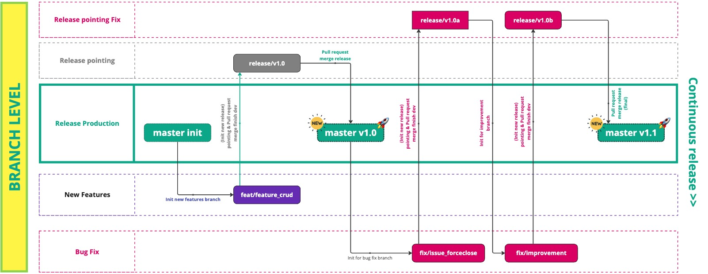

### Standarisasi Branching Develop didalam Team Engineer

Disini dibagi menjadi beberapa `branch` dimana branch-branch tersebut yang akan menjadi acuan untuk `production` atau `develop`, dan disini kita bagi ke beberapa layer utama yakni sebagai berikut

- **Release pointing Fix**, Branch target source release versi berikutnya khusus bug fix issue / case yang muncul 
- **Release pointing**, Branch target source release versi berikutnya sebelum production
- **Release Production**, Branch target source release production, biasa yaitu branch `master`
- **New Features**, Branch untuk develop khusus new features
- **Bug Fix**, Branch untuk develop khusus bug fix

Dengan demikian continuous release akan terus berkelanjutan, dengan adanya brancing ini akan lebih mudah di tracking, dan memudahkan jika ingin rollback ke features berikutnya