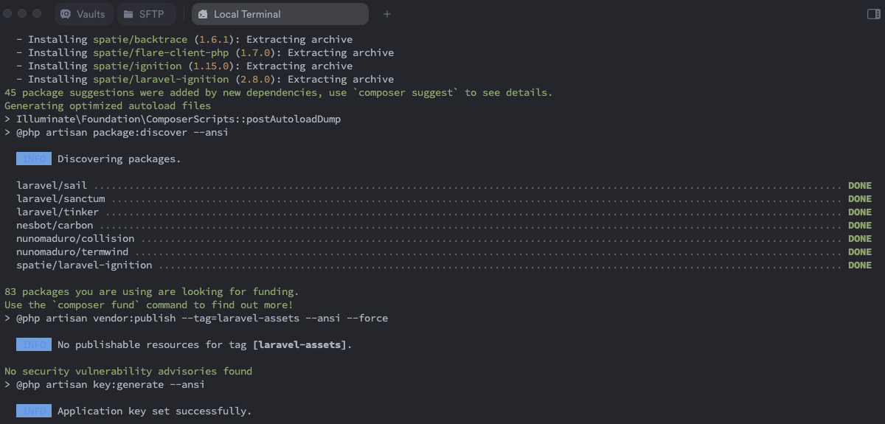
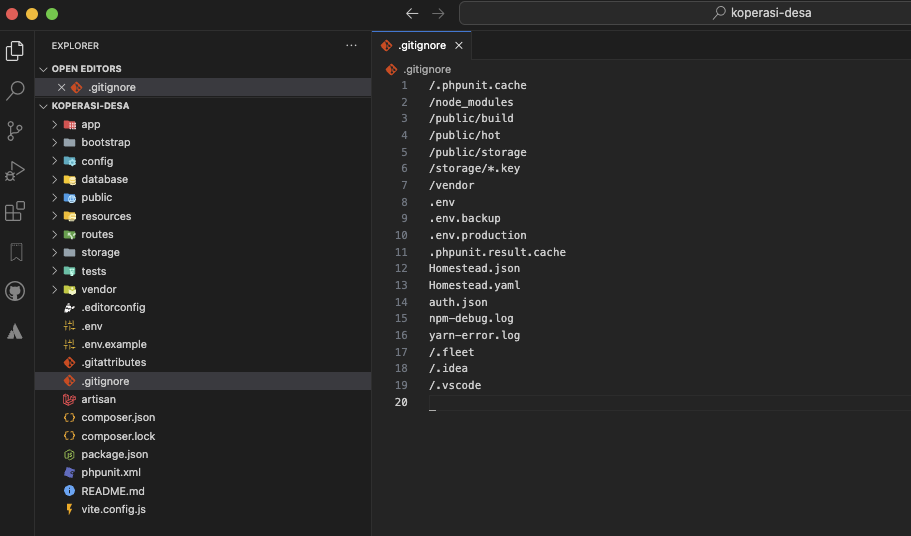
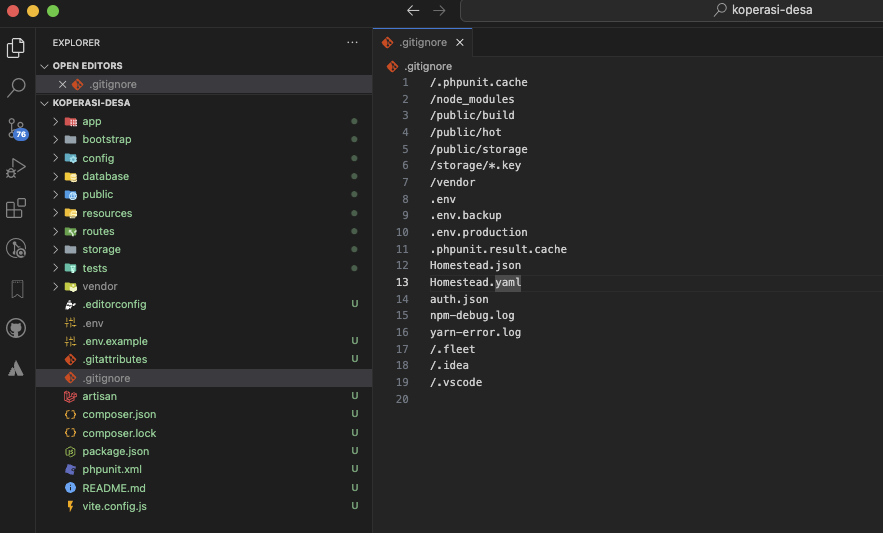
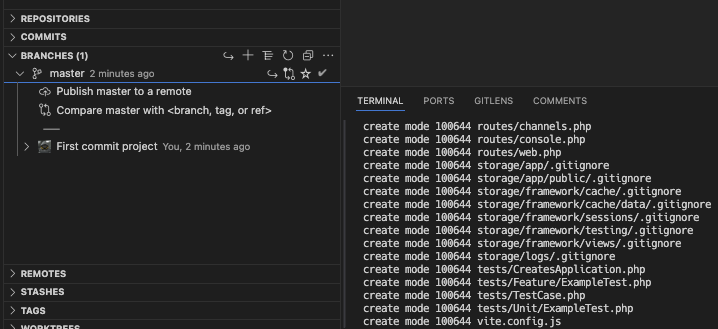

# Init Project Git Local
Selanjutnya kita akan mendemonstrasikan bagaimana memulai (inisialisasi) git pada project local komputer kita sampai dengan remote repository, sehingga untuk memaintain project bisa dan dapat di monitor secara berkala dan sistematis, berikut kita akan buat project untuk dapat mengintegrasikan git

### a. Membuat Project Laravel
Sebelum itu kita perlu cek PHP version kita pada komputer local kita seperti berikut

```.sh
╰─○ php --version
PHP 8.2.20 (cli) (built: Jun  4 2024 13:22:51) (NTS)
Copyright (c) The PHP Group
Zend Engine v4.2.20, Copyright (c) Zend Technologies
    with Zend OPcache v8.2.20, Copyright (c), by Zend Technologies
```

Untuk versi php yang akan kita gunakan adalah versi Laravel 10 maka untuk membuat project dapat dilakukan seperti berikut

```.sh
╰─○ composer create-project laravel/laravel koperasi-desa "10.*" 
Creating a "laravel/laravel" project at "./koperasi-desa"
Installing laravel/laravel (v10.3.3)
  - Installing laravel/laravel (v10.3.3): Extracting archive
Created project in /Users/goodevaninja_mac1/Desktop/laravel/koperasi-desa
> @php -r "file_exists('.env') || copy('.env.example', '.env');"
Loading composer repositories with package information
Updating dependencies
. . . . >> tunggu sampai proses pembuatan project selesai
```

Pastikan sudah seperti pada gambar berikut



### b. Init & Setup .gitignore Git pada Project
Pada tahapan selanjutnya kita akan buka project yang baru saja dibuat dengan vscode

```.sh
╰─○ cd koperasi-desa
╰─○ code .

Tunggu sampai VSCode membuka project tujuan kita
```

`

Jika sudah kemudian untuk meng-inisialisasi git project tersebut kita cukup ketikkan command berikut

```.sh
╰─○ git init
Initialized empty Git repository in /Users/sample/Desktop/laravel/koperasi-desa/.git/
```

Jika sudah maka akan tampak seperti berikut



```.sh
╰─○ git add .
╰─○ git commit -m "First commit project"
[master (root-commit) a4805a1] First commit project
 76 files changed, 11238 insertions(+)
 create mode 100644 .editorconfig
 create mode 100644 .env.example
 create mode 100644 .gitattributes
 create mode 100644 README.md
 create mode 100644 app/Console/Kernel.php
 create mode 100644 app/Exceptions/Handler.php
 create mode 100644 app/Http/Controllers/Controller.php
 create mode 100644 app/Http/Kernel.php
 create mode 100644 app/Http/Middleware/Authenticate.php
 create mode 100644 app/Http/Middleware/EncryptCookies.php
 . . . . 
```

Dengan demikian proses inisialisasi sudah berhasil

