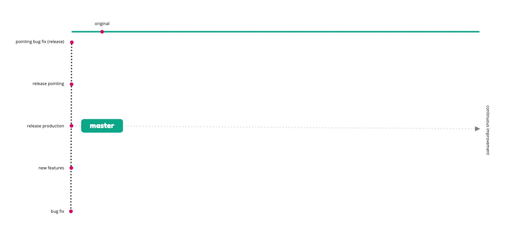
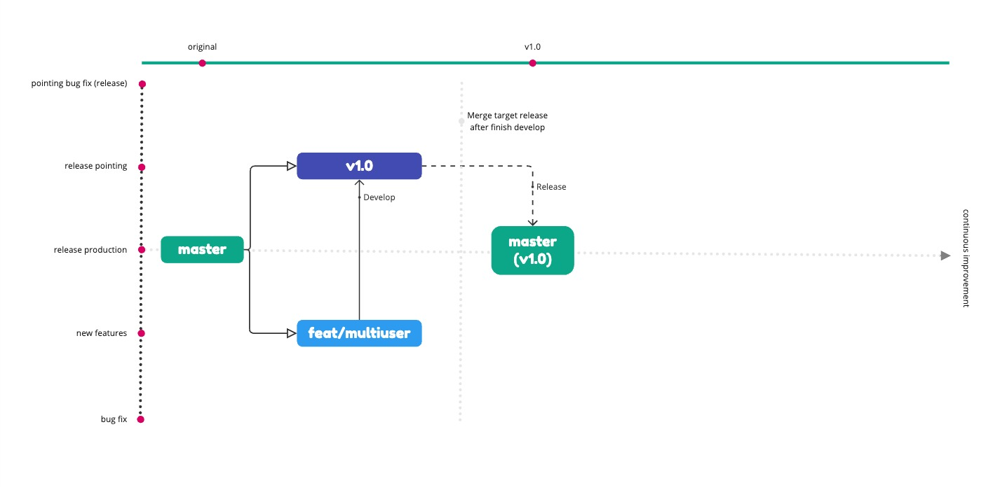

# Maintain Versioning via Control Pull Request (PR)
Untuk tahapan maintain version, jika bisa page sebelumnya difahami terlebih dahulu, pada section ini kita akan mulai mengimplementasika teknisnya agar lebih gampang difahami dan bisa mengetahui perbedaan dari setiap versinya, bisa dilihat pada bagan gambar dibawah ini, dengan menggunakan bagan dibawah akan lebih mudah di bayangkan dan diintegrasikan khususnya.


### 1st : Gambaran Branch Develop dan Branch target Rilis berikutnya
Pada basic project, sebenarnya branch hanya 1 yaitu `master`, tetapi pada saat proses development dan versioning kita memerlukan branch-branch yang di gunakan untuk / sebagai artifact dimana sebelumnya jg bisa kita rollback versi apps yang pernah kita develop


Dimana versi branch awal kita akan tampak seperti berikut



Untuk selanjutnya kita akan mencoba membuat 1 feature yang bisa kita jadikan sebagai fitur baru untuk kita buat di release terbaru


### 2nd : Teknis Setup Proses Develop
Selanjutnya kita akan melakukan teknis agar dapat seperti pada gambar diatas, berikut kita akan mulai dengan inisialisasi update 


Ditahapan ini kita akan membuat simple perubahan dahulu, pertama dari README.md, selanjutnya kita buat branch baru untuk branch develop (source) yaitu `feat/multiuser` dan `v1` untuk target merge branch, dan dimana nanti branch `v1` ini akan di merge ke production yaitu ke branch `master`

```.sh
~$ git branch feat/multiuser
~$ git checkout feat/multiuser 
M       README.md
Switched to branch 'feat/multiuser'
```


Berikutnya


Kita coba cek all branch dengan mengetikan command `git branch -a`


Selanjutnya lakukan command seperti berikut

```.sh
~$ git branch -a
~$ git checkout master
M       README.md
Switched to branch 'master'
~$ git push origin v1.0 
~$ git push origin feat/multiuser
```

Seperti tampak pada gambar berikut


Setelah di push pada repository akan langsung muncul all branch jika kita lihat seperti dibawah ini


Berikutnya kita akan checkout ke branch `feat/multiuser` kemudian kita lakukan commit dan push update dari file sebelumnya ke branch tersebut sebagai berikut


Secara otomatis pada repository akan muncul comparasi branch seperti dibawah ini, dan selanjutnya kita buatkan PR


Klik pada tombol `Compare & pull request`, buat title dan deskripsi dari PR tersebut, dan kemudian arahkan source branch `feat/multiuser` ke `v1`, seperti pada gambar berikut


Maka dari itu kondisi saat ini kurang lebih branch akan tampak seperti pada gambar berikut



_Done & Soon..._

**Maintain branch for fix issue / bug and release of apps**

_To be next journals..._