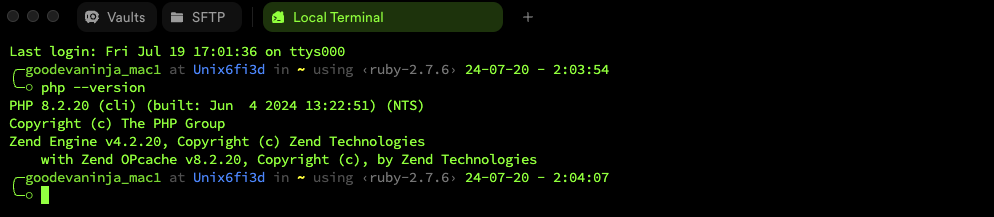
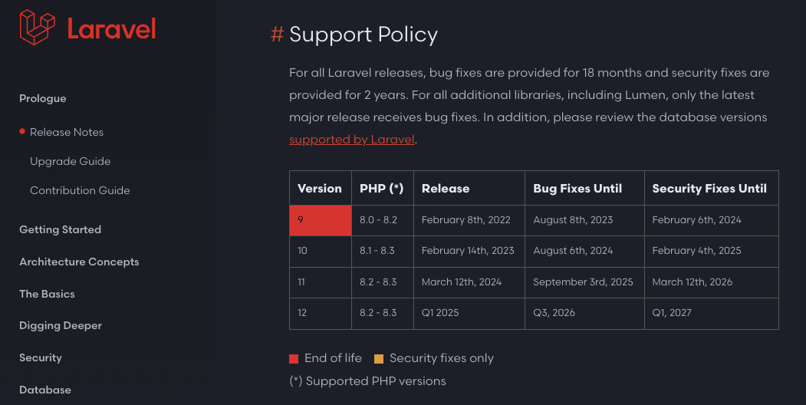
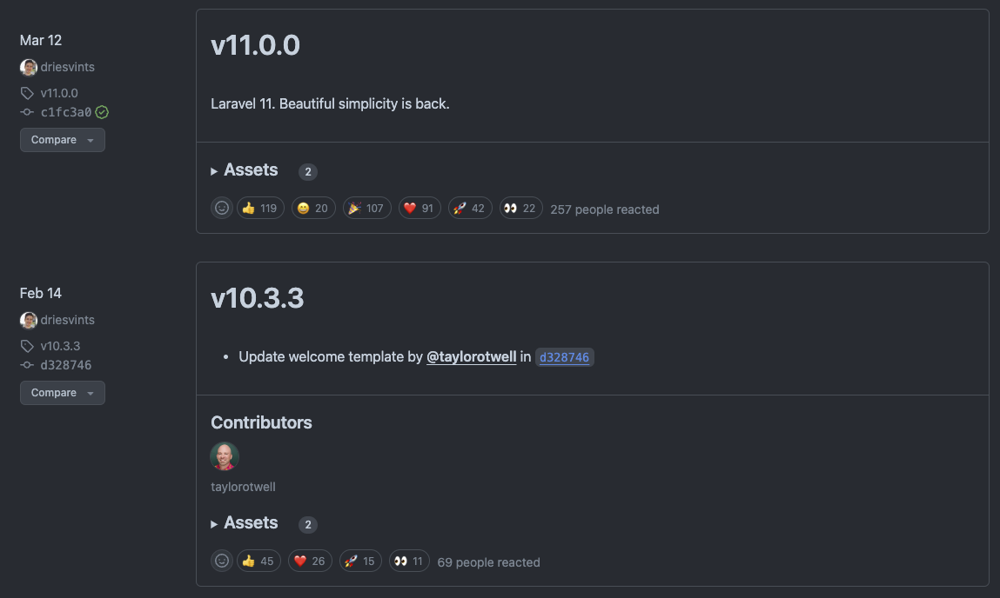
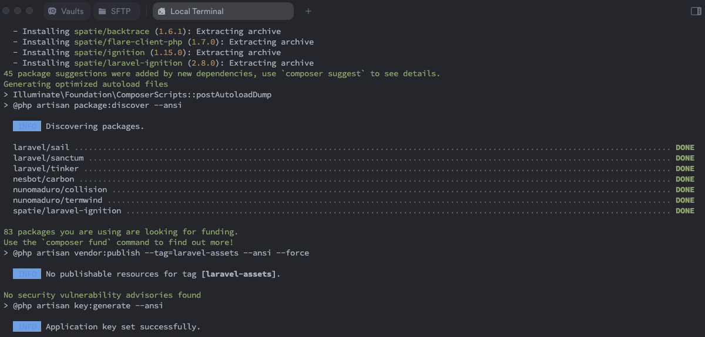
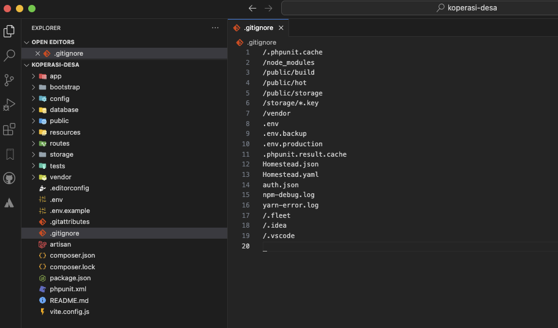
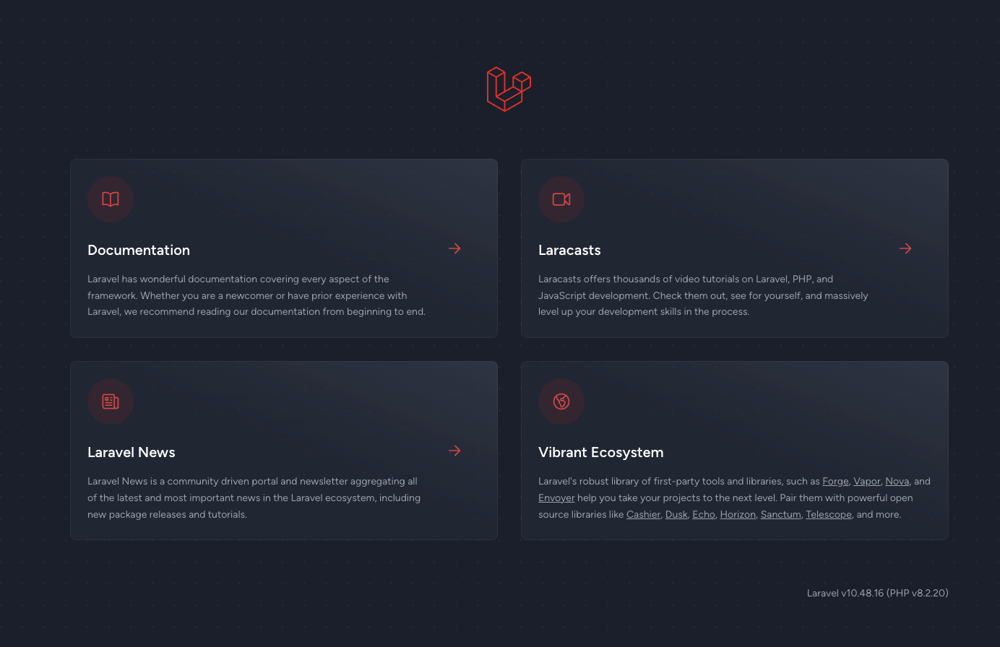

# Membuat Project Laravel - Starter
Untuk membuat project laravel - Starter kita perlu beberapa tools pendukung yakni kita perlu menginstallkan Aplikasi Web Server seperti Xampp, Wampp dan sejenisnya karena aplikasi tersebut sudah menyediakan tools yaitu PHP, Web Server beserta Database MySQL. Karena kita sudah menginstallkannya ke komputer kita kita dapat mengecek Versi PHP seperti berikut

### 1st : Check PHP Versi & Support Laravel

```.sh
~$ php --version
PHP 8.2.20 (cli) (built: Jun  4 2024 13:22:51) (NTS)
Copyright (c) The PHP Group
Zend Engine v4.2.20, Copyright (c) Zend Technologies
    with Zend OPcache v8.2.20, Copyright (c), by Zend Technologies
```



Kemudian untuk itu kita perlu check php kita support untuk Laravel versi berapa



Jika mengacu pada versi php, kita sudah dapat menggunakan versi Laravel 11 (per 20 Juli 2024) Sumber: <a href="https://laravel.com/docs/11.x/releases">Laravel 11</a>, namun kita dapat menginstallkan versi laravel yang dibawah itu, yaitu kita akan menginstallkan versi Laravel 10, karna memang pada saat jurnal ini dubuat Laravel 10 yang paling stabil, dan kita menunggu sampai Laravel 11 stabil baru kita akan update kembali di jurnal berikutnya

### 2nd : Membuat Project Laravel
Untuk membuat project laravel dengan versi 10 kita harus menggunakan command seperti berikut

```.sh
~$ composer create-project laravel/laravel koperasi-desa "10.*" 
Creating a "laravel/laravel" project at "./koperasi-desa"
Installing laravel/laravel (v10.3.3) <<--
  - Installing laravel/laravel (v10.3.3): Extracting archive
Created project in /Users/goodevaninja_mac1/Desktop/laravel/koperasi-desa
> @php -r "file_exists('.env') || copy('.env.example', '.env');"
Loading composer repositories with package information
Updating dependencies
. . . . >> tunggu sampai proses pembuatan project selesai
```

Jika kita mengacu pada laravel 10 yang paling stable versinya di versi 10.3.3



Tunggu sampai proses pembuatan project selesai seperti berikut



Dengan demikian project laravel kita sudah berhasil dibuat

### 3rd : Menjalankan Project Laravel 10
Sebelum menjalankan prpoject kita buka project terlebih dahulu di VSCode seperti berikut

```.sh
~$ cd koperasi-desa
~$ code .

Tunggu sampai VSCode membuka project tujuan kita
```



Setelah dibuka, untuk menjalankan project laravel 10 kita yang baru saja dibuat, cukup dengan command seperti berikut

```.sh
~$ php artisan serve

   INFO  Server running on [http://127.0.0.1:8000].  

  Press Ctrl+C to stop the server
```

Untuk melihat tampilan dari apps yang sudah running cukup copy atau tekan CTRL + Klik http://127.0.0.1:8000 pada terminal dan tampilan dari project kita kurang lebih seperti berikut

